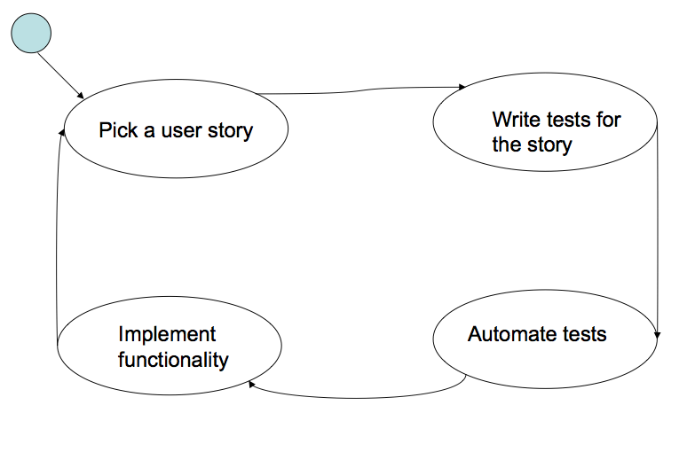

# Testdrevet utvikling
Fra et TDD-ståsted er det urimelig å separere testing og implementasjon. Når en implementasjonsstrategi er bestemt, har en og indirekte valgt en teststrategi.

TDD oppfordrer til å skrive tydelige krav.
Dele opp utviklingen i mindre steg som kan testes separat.
Minimalistisk kode, samt YAGNI ("You ain't gonna need it"). En bør kun skrive kode som oppfyller kravet (fullfører testen), verken mer eller mindre.

Legg merke til at TDD ikke krever smidig utvikling. Det legges vekt på at testing og implementering er to parallelle aktiviteter.

## Testing for greenfield-prosjekter
> In many disciplines a greenfield is a project that lacks any constraints imposed by prior work. The analogy is to that of construction on greenfield land where there is no need to remodel or demolish an existing structure. – Wikipedia

I slike prosjekter står en i prinsippet fritt til å selv velge programmeringsspråk, arkitektur, utviklingsmetode og detaljert design. I realiteten vil dog company policy, tilgjengelige verktøy, samt egen kunnskap og erfaring være ting som setter begrensninger.

### Detaljer eller det "store bildet"
En må velge mellom å starte med å løse alle små problemer for så å kombinere de til en komponent, eller en kan løse design problemet først for så å inkludere alle detailer.

I de fleste tilfeller vil vi først starte med å skrive tester, og deretter kode etter bekymringer.

### Usikkert terreng eller det kjente
Om en utforsker ukjent terreng vil en så godt en kan forsøke å redusere risiko. Det kjente vil på den andre siden gi en større fordeler raskere.

Se på dette som et kost/nytte-problem. Skriv tester først, kode deretter på en måte som gir en best kost/nytte-ratio.

Hovedprinsippet er å utsette viktige beslutninger så lenge som mulig – _men aldri lenger_. I mellomtiden vil en samle informasjon som gjør en i stand til å møte utfordringene så godt forberedt som mulig.

### Highest value vs. the low-hanging fruits
Også et kost/nytte-problem.

Om en går for de lavthengende fruktene vil en raskt og billig kunne demonstrere mye funksjonalitet tidlig i prosjektet. Det er også lettere å både kode og teste slike alternativer.

### Happy paths vs. error situations
Selv om krav til robusthet er eksteme vil en først behøve å teste og kode noe som er av nytte for brukeren. Feilhåndtering kommer (som regel) etterpå.

Unntak til denne regelen er situasjoner hver en behøver feilhåndtering tidlig, som for eksempel i innloggings-fuksjoner. Her er kravet til feilhåndtering vevd så tett inn at det må taes med én gang.

### Essensielle TDD-konsepter

Fixtures
: Sett objekter som vi har instansiert for å bruk i testene
: En fixture er et stykke kode vi ønsker å teste

Test doubles
: _"Object stand-in"_. Ser ekte ut fra utsiden, men kjører fortere og er enklere å utvikle og vedlikeholde.
: Brukes for to typer testing: tilstandsbasert testing og interaksjonsbasert testing.
: _stubs_, _fakes_, _mocks_.

Test doubles brukes for å teste et objekt uten å måtte skrive all kode som objektet skal benytte seg av. Dette gjør en i stenad til å etablere en stegvis implementasjon etter hver som en suksessivt erstatter stadig flere doubles. Om en implementerer doubles korrekt kan en være sikker på at eventuelle problemer i koden ikke stammer fra miljøet, men fra det som testes.

Tilstandsbasert testing
: Brukes for å teste hvor godt et objekt lytter. Responderes det korrekt på input?

Interaksjonsbasert testing
: Brukes for å verifisere hvordan et objekt snakker med sine kollaboratører.

Guidelines for a testable design
*	__Unngå komplekse private metoder__
	
	Det er vanskelig å teste private metoder direkte, men om det er mulig kan disse testes indirekte.
*	__Unngå final metoder__
	
	Veldig få programmer trenger final metoder, så oddsen er at du også ikke trenger det.
*	__Unngå static metoder__
	
	De fleste metoder skal IKKE være static, men enkelte har hatt en praksis at utility classes full av static metoder fordi metodene ikke skal være relevante til enkelte objekter.
*	__Bruk "new" med forsiktighet__

	Bruk av new er den vanligste formen for hardkoding, hver gang new skrives så opprettes et nytt objekt. Derfor burde vi bare instansiere objekter som vi ikke vil subsidiere med [test doubles](#Essensielle-TDD-konsepter).
*	__Unngå logikk i constructors__

	Constructors er nærmest umulig å unngå siden subklassers constructor vil alltid kalle på minst en superklasse constructor. Derfor burde vi unngå test kritisk kode eller logikk i constructors.

*	__Unngå Singleton__

	Bruk av Singleton skaper problemer for testing, særlig da det skal kjøres tester på kode som benytter seg av en singleton klasse. Da må denne være inkludert i testen for at resultatet skal være gyldig, dette er ikke ønskelig da vi ønsker å teste så lav nivå som overhode mulig.
	

Legacy code
Det meste av utvikling er endringer på eksisterende kode. [TDD](#Testdrevet-utvikling) forventer at vi skriver tester, så kode som tilfredstiller denne testen. Denne fremgangsmåten er ikke tilfredstillenden for Legacy code, da koden allerede eksisterer. Derfor er følgende foretrukket istedet:

1. Identifiser hvor det må gjøres endringer.
2. Identifiser et vendepunkt.
3. Dekk identifiserte vendepunkt.
	* Fjern interne avhengigheter.
	* Fjern eksterne avhengigheter.
	* Skriv tester
4. Gjør endringer
5. Refactor dekket koden 

### Enhetstesting-patterns

#### Assertion

`assertEqual(java.lang.String expected, java.lang.String.actual) throws AssertionFailedError`

* `assertFalse(…)`
* `assertTrue(…)`
* `assertEquals(…)`
* `assertNotEquals(…)`
* `assertNotSame(…)`
	* kontrollerer at to objekter ikke refererer til det samme objektet
* `fail(…)`

En assertion bør plasseres så nært den nye koden som mulig, samt rett etter hver nye vikige kodesnutt. Intensjonen er å oppdage feil så raskt som mulig for å kunne redusere debugging-innsats.

Det er svært viktig å oppdage feil så raskt som mulig, da en da har mindre kode å gå gjennom for å lokalisere den. For å oppnå dette trenger vi assertions der hvor vi trenger å kontrollere at vi er på riktig kurs.

Assertionens type avhenger av dens bruk. De viktigste typene er:

##### Resulting state assertion
1. Eksekvér en funksjonalitet
2. Kontrollér at den resulterende tilstanden er som forventet ved bruk av en eller flere assertions.

##### Guard assertion
Brukes for å kontrollere at våre forutsetninger om status før eksekvering av ny kode er korrekte.

`assertTrue(…)`

Ny kode

`assertNotSame(…)`

##### Delta assertion
Istedet for å kontrollere absolutte verdier kontrollér forandringer i verdien. Dette gjør at en ikke trenger et "magisk nummer" i testen, og testen vil være mer robust i forhold til forandringer i koden.

##### Custom assertion
Dekker et bredt spekter tilpassede assertion-patterns. Kalles gjerne "fuzzy patterns". Benytter seg av mer komplekse predikater og uttrykk (`custom_assertInRange(…)`).

Disse må skreddersys til den assertion som skal gjøres, men gjør en i stand til å dekke et bredt område viktige testsituasjoner. Over tid vil en kunne skape et bibliotek assertions som kan gjenbrukes.

##### Interaction assertion
Kontrollerer ikke at koden fungerer som forventet, men at den samarbeider med våre kollaboratører som forventet (COTS) basert på foreliggende dokumentasjon. Benytter seg av de samme asserts diskutert over.

### Ta vare på eller forkaste?
Skal en fjerne assertions fra produksjonskode? Avhenger av patterns. Delta og custom er mer robuste for forandringer i koden.

## Testing for forandring av legacy-kode
Mesteparten av utvikling gjort vil forholde seg til foreliggende legacy-kode. 

### Prosess
1. Identifisere hvor i koden det skal forandres
2. Identifisere et inflection-punkt
3. Dekke identifisert inflection-punkt
	* Brekk interne avhengigheter
	* Brekk eksterne avhengigheter
	* Skriv tester
4. Gjør forandringer
5. Refaktorere dekket kode

Inflection-punkt er et punkt downstream fra forandringspunkt hvor en kan oppdage relevante forandringer i koden. Vi foretrekker inflection-punker så nært som mulig til forandringspunktet.

Etter hver som vi forandrer legacy-kode vil vi bruke både karakteriseringstester og ny-kode-tester. Førstnevnte for å kontrollere at vi ikke brekker noe av oppførsel vi ønsker å beholde. Sistnevnte for å kontrollere at de forandringer vi gjør har ønsket effekt.

## TDD og akseptansetesting

### Valg av user story

Prioritering i forhold til forretningsverdi og teknisk risiko, om der ikke foreligger en prioritering fra før.

Leverage = (Business value - Tech. risk) / Tech. risk

Ellers vil en på dette stadiet ha en god innsikt i brukerens krav og behov gjennom uformelle diskusjoner o.l.

### Skrive tester for historien
Sitt sammen med kunde og beskriv de viktigste scenarioer for denne user-storien. Kom så til en avtale om hva som behøves implementert for å kunne realisere hvert scenario.

Resultatene fra disse samtalene vil være et sett godt definerte tester og forventede resultater (akseptansekriterier). Sistnevnte inkluderer forventede resultater og systemets forventede tilstand etter endt test.

### Automasjon av testene
Tabellrepresentasjon (ala (FITNESS)[#fitness] brukes mye. Det en da trenger er: 

* Funksjonens ID
* Input-parametre
* Forventede resultater

