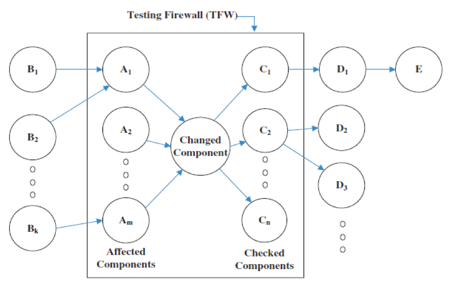

# Firewall for regresjonstesting
Her brukes konseptet om en firewall for å redusere settet klasser eller komponenter som behøves testes. Dette da de fleste regresjonsteseter er store og tidkrevende.

En firewall i denne sammenhengen er en separator mellom de klasser som beror på en klasse som endres fra resten.

Dependency, encoding

1. Gitt to suksessive versjoner av et objektorientert system, identifisér klasser som har blitt endret.
2. Dersom en klasse er en del av et arvshierarki må en også anse etterkommere av den endrede klassen som endret.
3. For hver endrede klasse, identifisér alle klasser som sender eller mottar meldinger til/fra den endrede klassen og inkludér de inne i firewallen.
4. Identifisér alle datastier til og fra den endrede klassen
5. Finn alle eksterne klasser i den modifiserte klassens omfang og inkludér de i den utvidede firewallen

Punkt 4 og 5 er en utvidet firewall.

## Dependency
> Is the component dealing with the plain values of the input?

> Must the component account for how those inputs were generated?

IKKE FERDIG