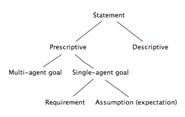

## Traceability

From test to requirement
: Why do we need this test?

From requirement to test
: Where is this requirement tested?

Når en skal endre/justere et krav an en også finne relevante tester.

## Challenges

Funksjonelle(Hva et system må gjøre) vs. ikke-funksjonelle(hvor bra systemet utfører funksjonene)
"Defined operational capabilities -> Satisfy business needs"

Se foil 2-1 for faktorer som gjør prosjekter vanskelige og grunnen til at prosjekter blir kansellert.

## Krav utvikling
Requirements Elicitation(Hvordan man kommer frem til krav) : Prosessen der man finner kravene til et system gjennom kommunikasjon med kundene, systembrukerne og andre stakeholders(interessenter).
_Teknikker_ : Metodisk ekstraksjon av konkrete krav fra høynivå mål. kvalitetsmålprioritet til krav. (Quality Metrics)

_Eksempler på ikke-tilfredstillende krav:_ Ariane 5: Et dyrt rakettoppskytingsystem. Her antok man visse parametre fra forløperen Ariane 4, som viste seg å ikke stemme. Dette førte til selvdestruksjon og 500mill euro i dass. Airbus: Krav: Revers kan bare brukes når flyet har landet. Oversettelse: Revers kan bare bruke mens hjulene roterer. Implementasjon: Reverse kan bare brukes mens hjulene roterer fort nok. 
Situasjon: Regnstorm og vannplaning, noe som resulterer i et krasj fordi reversen ikke kan benyttes(siden hjulene ikke roterer). Viktig å være nøye i modelleringen. 

Formålet med smidig utvikling
: utsette så mange avgjørelser så mye som mulig for å øke graden av frihet til ens forståelse er god nok. Øke forståelse ved å ta med folk som kan noe om lignende problemer.

Skille mellom kunde og faktisk bruker. Kjøper for å løse et (*konkret*?) problem.

## Two types of requirements statements

Deskriptive statements
: Observasjon av den virkelige verden, uavhengig av systemets oppførsel. Eks: Er togdørene åpne er de ikke lukket. 

Preskriptive statements
: Beskriver ønskelige egenskaper om systemet, som kan stemme avhengig av hvordan systemet oppfører seg. 
: Slik tilstanden oppfattes av systemet.
: Enforced **solely** by the software-to-be. Formulert av fenomen som deles mellom programvare og miljø.
: Programvare forstår dette via sensorer, handler med aktuatorer.
Eks : Togdører skal alltid være lukket mens toget beveger seg. 

### Formulering av systemkrav
Eksempel: Alle togdører skal være lukket mens toget beveger seg. I tillegg til denne preskriptive uttalelsen trenger vi hjelp fra andre komponenter: Togkontrolleren som er ansvarlig for trygg dørkontroll. Passasjerene må ikke åpne dører på en utrygg måte. At dørene fungerer skikkelig(agentene).

## Domene egenskaper
En domeneegenskap: Er en deskriptiv uttalelse om et problem. Uttalelsen burde holde uansett hvordan systemet oppfører seg, og er ofte i relasjon med fysiske lover. Eks: Et tog flytter seg kun hvis farten er !0 (ikke 0).

## Målorientering
: Et mål er et mål systemet skal oppnå. Kan være alt fra høynivå strategier til lavnivå tekniske bekymringer. Systemet består av både programvaren og miljøet, interaksjon mellom agenter(enheter, mennesker, programvare).
: Mål kan være på forskjellig nivå: 
	: Høynivå: Et mål krever koordinering mellom mange agenter. Eks: Systemets transportkapasitet skal økes med 50%
	: Krav : Et mål som en enkelt agent har ansvaret for i _systemet_.
	: Forventning: Et mål som en enkelt agent har ansvaret for i _miljøet til systemet_. 

### Typer mål
* Soft goals
	* Eks: Passengers should be better informed about flights.
	* Improve
	* Maximise/minimise
	* Increase/reduce
* Behavioural goal
	* System behaviour
	* Agent behaviour
	* Achieve/Cease
	* Maintain/Avoid

Se foil 2-1 for eksempel på Goal-types, behavioural goal specialization(Maintain, Achieve, Avoid etc) og Goal categorization.

## Mål kategorisering
Se foil for "diagram". 

* Funksjonelle mål: Eksempel: Kontrolleren på et tog skal oppdatere togets akselerasjon til den kommanderte med en gang bekreftelse på akselerasjonskommandoen er mottatt.
Funksjonelle mål vil tilfredstille agent forespørsler(Satisfaction). Funksjonelle mål vil holde agenter oppdatert på viktige systemtilstander(Information). Funksjonelle mål vil gi riktig respons til en hendelse(Stimulus-response). 
* Ikke-funksjonelle mål: Togets fysiske hastighet og kommanderte hastighet skal ikke avvike mer enn X km/t. Ikke-funksjonelle mål uttrykker en kvalitet eller begrensning på en tjeneste. _Accuracy goal:_ Ikke-funksjonelle mål krever at tilstanden til variabler programvaren kontrollerer reflekterer de fysiske tilstandene miljøagenten kontrollerer. Altså det at fysisk hastighet og kommandert hastighet ikke skal avvike mer enn X.
* Myke-mål (soft goals): Forskjellig fra ikke-funksjonelle mål. Soft-goals har ikke noe klart kriterie som bestemmer hvordan de oppfylles. F.eks "En minibank skal være mer brukervennlig". 

## Goal refinement (Avoid, maintain, helt ned til agenter)
Se foil 2-1 for refinement tree, eksempler på refinement ++. Tog eksempel. 
Mekanisme for å strukturere komplekse spesifikasjoner på ulike nivåer. Et hovedmål kan deles opp i delmål som igjen kan deles opp i krav(på programvaren) og forventninger(på miljøet). Krav på programvaren assosieres kun med èn agent. Mål og delmål kan være multiagent. 

## kvalitetsmålprioritet til krav (Quality metrics)

* Kvalitative mål-krav : Tilnærming til kravspesifikasjon hvor det blir mindre sannsynlig å produsere sporinger som er ukonsistente, støyende, ufullstendige osv. Se 2-1 for fullstendig oversikt over kvalitetsmålprioritet og diagrammer(Ambiguity, inconsistency, forward referencing,opacity, noise, completeness ) og hvordan disse regnes ut(formler). 

## Hvor får man mål fra?
Vi får mål fra: Preliminære analyser av det nåværende systemet. - Systematisk ved å søke på keywords i dokumentasjonen vi har tilgjengelig, f.eks "objective" "purpose" osv. - Iterativ redusering av høynivå mål, ved å 
spørre hvordan og hvorfor? Gir et goal refinement tree. - Tilnærming : KAOS - Måldrevet kravinnhenting. 

## Oppsummering

* Mål kan defineres på ulike abstraksjonsnivå.
* To måltyper: Behavioral eller softgoal
* Flere kategorier av mål: Funksjonelle - ikke funksjonelle. Goal refinement gir en naturlig mekanisme for å strukturere komplekse spesifikasjoner på ulike nivåer(goal refinement tree). 
## I dette kurset
*Funksjonelle mål* og *Quality of service*

