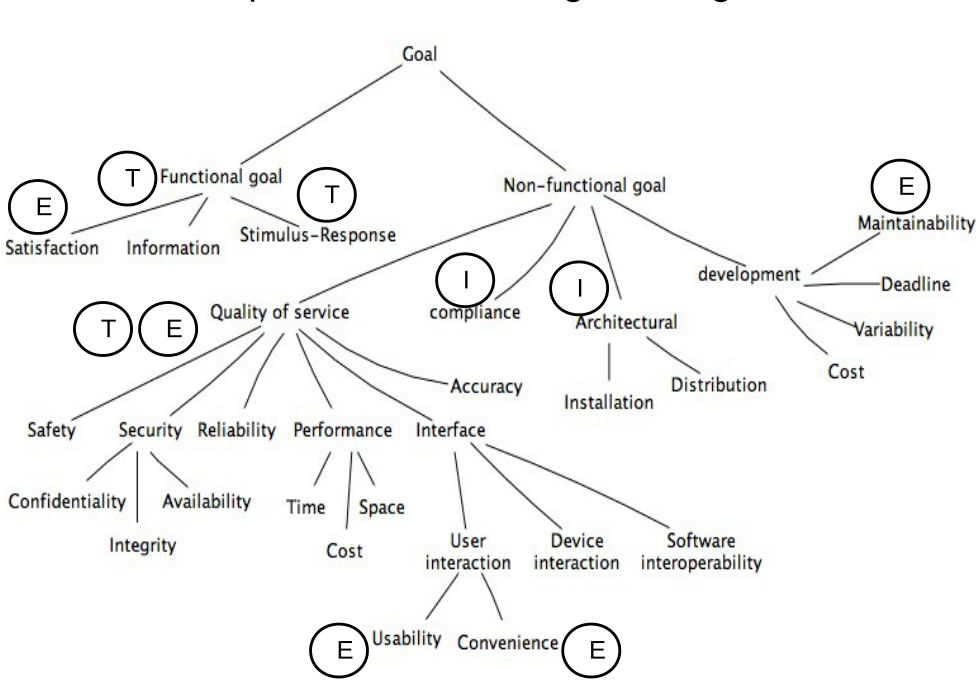

# Sporbarhet av krav
Sporbarhet av krav er av Gotel og Finkelstein definert som: 

> "[…] the ability to describe and follow the life of a requirement, _in both a forwards and backwards direction_, i.e. from its origins, through its development and specification, to its subsequent deployment and use, and through periods of on-going refinement and iterastion in any of the phases."
>
> __Gotel og Finkelstein__ (1994)

En legger med andre ord vekt på at alle de krav som et prosjekt har skal være sporbare _hele veien_ helt fra insepsjonen via utvikling og spesifikasjon til utplasseing og bruk.

For å oppnå dette er det definert en rekke mål:

* Projekthåndtering
	* Status: "Når vil vi være ferdige?" og "Hva vil det koste?"
	* Kvalitet: "Hvor nære er vi å nå våre mål?"
* Håndtering av kvalitetssikring
	* Forbedre kvalitet: "Hva kan vi gjøre bedre?"
* Endringshåndtering
	* Versjonering, dokumentasjon av forandringer (Hvorfor? Hva? Når?)
	* Analyse av endingsinnvirkning
* Gjenbruk
	* Varianter og produktfamilier
	* Krav kan bli målrettet for gjenbruk
* Validering
	* Finne og fjerne konflikter mellom krav
	* Kravs grad av kompletthet
* Verifisering
	* Sikre at alle krav er oppnådd
* Systeminspeksjon
	* Identifisere alternativer og kompromisser
* Sertifisering og revisjon
	* Bevis for at standarder følges.

## Utfordringer
Det foreligger en rekke utfordringer som en må ta hensyn til når det kommer til sporing av krav. Blant disse er:

Spor må identifiseres og registreres blant et stort antall hetrogene entiteter, instanser, 
Det kan være vanskelig å skape betydningsfulle relasjoner i en slik kompleks kontekst.

Spor er videre i konstant forandring og bevelgelse, ettersom de vil kunne forandres ved forandringer i krav eller utviklingsartefakter.

Stor variasjon i verktøy, basert på matriser, hyperlenker, tagging, identifiers. Fortsatt må det meste av arbeidet utføres manuelt.

Sporinformasjonen er aldri komplett. Dette grunnet komplekse systemer av sporingservervelse og -vedlikehold.

Grunnet mangel på kvalitetsattributter er tillit en stor utfordringer. Det nytter eksempelvis ikke at en vet at 70% av alle sporingskoblinger er nøyaktige om en ikke samtidig vet hvilke koblinger som utgjør disse 70%.

Prosjektet har gjerne en rekke ulike interessenter. Disse har ulikt syn på prosjektet avhengig av sin rolle. Disse vil følgelig ha ulike syn på sporbarheten av krav.

Håndtering av kvalitetssikring handler om å maksimere et produkts _kvalitet_. Denne kvaliteten skal være dokumentert i kravsspesifikasjonen, og spørsmål som derfor spørres i denne sammenhengen er _"Hvor nære er vi kravsspesifikasjonen vår?"_ og _"Hva kan vi gjøre bedre?"_.

Endringshåndtering handler om å spore effektene av hver enkelt endring. Dette gjøres ofte via firewall, etc.

Gjenbruk vil peke på de aspekter av en gjenbrukt komponent som behøves adapteres til de nye systemkravene. Til og med kravene i seg selv kan være ting som kan gjenbrukes.

Validering vil bruke sporbarheten til å peke på kravenes kvalitetet når det kommer til kompletthet, tvetydighet, forward referencing, opasitet (tetthet). Vil også sikre at hvert av kravene dekkes av minst én del av produktet

Verifikasjon vil sjekke at de begrensninger en har overholdes.

I tillegg kommer det utfordringer relatert til sertifisering/audit, samt testing og vedlikehold.

## Metamodeller

Modell
: En abstraksjon av virkeligheten.

Metamodell
: Modeller av modeller, en videre abstraksjon av virkeligheten som belyser egenskaper ved modellen.

Metamodeller for sporbarhet av krav benyttes ofte som basis for sporbarhetsmetodologier og -rammeverk. Dette for å kunne fastslå og definere hvilke typer artefakter som skal spores, samt definere hvilke typer relasjoner som kan etableres mellom disse artefaktene.

[STAKEHOLDER] --Manages--> [SOURCE] --Documents--> [OBJECT]

[STAKEHOLDER] --Has role in --> [OBJECT]

[OBJECT] --Traces to--> [OBJECT]

[STAKEHOLDER] --Has role in --> --Traces to--> [OBJECT]

Der skilles ofte mellom high-end- og low-end-sporbarhet.

## Tilnærminger til sporbarhet
Det er en kritisk oppgave å kunne etablere koblinger, både mellom ulike krav, og mellom krav og andre artefakter. Manuell kobling og vedlikehold av slike koblinger er både dyrt og utsatt for feil. En ønsker derfor å kunne helt eller delvis automatisere denne oppgaven.

### Manell sporingskobling
Manuell sporingskobling er den enkleste formen for sporbarhet. Her benytter en seg av _sporbarhetsmatriser_, enten ved bruk av hypertekst eller regnearkprogram som for eksempel Microsoft Excel for å skape kryssreferanseskjema. Der er i hovedsak to problemer med denne tilnærmingen: over tid vil det å vedlikeholde et stort antall koblinger bli vanskelig; og da koblingene er statiske (mangel på attributter) vil mangel på automasjon av oppgaver være begrenset.

<table>
	<tr>
		<td>Unik ID</td>
		<td>Krav</td>
		<td>Kilde til krav</td>
		<td>SW-krav-spek./ Funk. krav. dok.</td>
		<td>Design-spek.</td>
		<td>Program-modul</td>
		<td>Test-case(r)</td>
		<td>Vellykket test-verifikasjon</td>
		<td>Modifikasjon av krav</td>
		<td>Bemerkninger</td>
	</tr>
	<tr>
		<td>…</td>
		<td>…</td>
		<td>…</td>
		<td>…</td>
		<td>…</td>
		<td>…</td>
		<td>…</td>
		<td>…</td>
		<td>…</td>
		<td>…</td>
	</tr>
	<tr>
		<td colspan="10" style="text-align:center;"><strong>Eksempel på manuelt kravssporingsskjema.</strong>
	</tr>
</table>

### Scenario-drevet sporbarhet
Scenario-drevet sporbarhet er en _testbasert_ tilnærming som benyttes for å avdekke relasjoner mellom krav, design og kodeartefakter. [Alexander Egyed](http://www.alexander-egyed.com/publications/A_Scenario-Driven_Approach_to_Traceability.pdf) er anerkjent som forfatteren av denne tilnærmingen.

Trikset benyttet er å observere kjøretids-oppførselen til testscenarioer. Eksempler på verktøy som benytter seg av denne tilnærmingen er [IBM Rational PureCoverage](http://www.jfind.com/listings/1711.shtml). Kjøretidsoppførselen til applikasjonen oversettes til en grafstruktur som benyttes til å indikere fellestrekk mellom entiteter assosiert med hendelsen.

Metoden benytter seg av det den kaller et _footprint_ for å oppnå sporbarhet. Dette fortsporet inneholder informasjon om det settet klasser som ble eksekvert når et spesifisert scenario testes, og antallet metoder som ble eksekvert i hver av disse klassene.

<table>
	<tr>
		<td></td>
		<th>Test-scenario</th>
		<th>Artefakt</th>
		<th>Observerte Java-klasser</th>
	</tr>
	<tr>
		<td>1</td>
		<td>Se liste over filmer</td>
		<td>[s3]</td>
		<td>[C, J, R, U]</td>
	</tr>
	<tr>
		<td>2</td>
		<td>Se kontekstuell informasjon om film</td>
		<td>[s4, s6] [r2]</td>
		<td>[C, E, J, N, R]</td>
	</tr>
	<tr>
		<td>3</td>
		<td>Velg/spill av film</td>
		<td>[s8, s9] [r6]</td>
		<td>[A, C, D, F, G, I, J, K, N, O, T, R, U]</td>
	</tr>
	<tr>
		<td>4</td>
		<td>Trykk stopp-knapp</td>
		<td>[s9, s11] [r8]</td>
		<td>[A, C, D, E, F, G, I, K, O, T, U]</td>
	</tr>
	<tr>
		<td>5</td>
		<td>Trykk spill-knapp</td>
		<td>[s9, s11] [r9]</td>
		<td>[A, C, D, F, G, I, K, N, O, T, R, U]</td>
	</tr>
	<tr>
		<td>6</td>
		<td>Bytt server</td>
		<td>[s5, s7]</td>
		<td>[C, R, J, S]</td>
	</tr>
	<tr>
		<td>7</td>
		<td>…</td>
		<td>…</td>
		<td>…</td>
	</tr>
	<tr>
		<td colspan="4" style="text-align:center;"><strong>Eksempel</strong></td>
	</tr>

</table>

Det er imidlertid noen problemer tilknyttet til denne tilnærmingen. Det en kan komme over er at der finnes scenarioer som ikke dekker noen krav, og der kan finnes scenarioer som hører til flere krav. Slike hendelser må markeres i en separat tabell. En benytter seg her av symbolene "F" (fixed) og "P" (probable) for å markere et tilfelle, avhengig av hvor sikre vi er på at en gitt klasse tilhører et gitt scenario.

### Utviklingsfotspor
Utviklingsfotspot (development footprint) er en løsning som gjør det mulig å skape sporbarhetsinformasjon, utviklet av (Inah Omoronyia)[http://www.informatik.uni-trier.de/~ley/db/indices/a-tree/o/Omoronyia:Inah.html] et al. Denne metoden krever at hver utvikler alltid identifiserer det krav/use-case som han/hun jobber med på et gitt tidspunkt. En utvikler kan kun jobbe med et enkelt use-case om gangen.

Resultatet av denne metoden vil være lik den som ved bruk av scenario-test-footpring-tabellen. Denne tabellen vil vise hvilke dokumenter, classer og lignende som har blitt aksessert gjennom arbeid med en gitt use-case.

Hovedproblemet med denne tilnærmingen er at det forekommer "falske" adganger. Dette kan skje eksempelvis ved at en utvikler ser på en del av koden som ikke tilhører det use-case som det på et gitt tidspunkt jobbes med. For å motvirke dette kan en supplere informasjonen som genereres med mer informasjon om en aksess' natur, tidspunkt og person som utførte aksesseringen.

Typer aksesseringstyper gitt i denne metoden er:

* C - Create
* U - Update
* V - View

### Ulemper ved bruk av scenario-drevet sporbarhet
Selv om scenario-drevet sporbarhet ofte er semi-automatiserte trenger de allikevel mye tid av systemingeniører som iterativt må identifisere et subsett testscenarioer og hvordan disse relaterer til kravsartefakter. Videre er det ikke alltid at krav som per metodene gitt over ikke er relaterte, ikke er relaterte i en annen form (som for eksempel deling av data, implementasjons-pattern).

Jeg ser for meg det er her Singleton-patternet kan være problematisk (TK).

## Sporing via tagging
Denne metoden er enkel både å forstå og å implementere. Ulempen er dog at den er sterkt avhengig av menneskelig innblanding. Prinsippet med tagging er at hver enkelt krav gis en _tagg_, enten manuelt eller av et verktøy. Hvert enkelt dokument, kodesnutt, etc. gis også hver sin tagg.

Ulike fremgangsmåter kan benyttes – tagger kan være enten enkeltnivå eller flernivå. Ved bruk av enkeltnivå (eks. R4) får en en enkel sporingsmatrise. Ved bruk av flernivå-tagger (eks. hvor R4.1 og R4.2 er sub-nivå av R4) vil en enkelt kunne gruppere logiske grupperinger av krav, og en kan dermed få mer detaljert sporingsinformasjon.

Sporbarhetens kvalitet vil bero på at vi alltid husker å (korrekt) tagge alle relevante dokumenter og artefakter. Der finnes verktøy som kan kontrollere at alle dokumenter i databasen er tagget, men korrektheten av disse taggene er derimot ikke gitt.

## Konklusjon
Det å kunne spore krav er et svært viktig aspekt ved kravshåndtering.

Prosjektets ulike interessenter har ulike behov for sporbarhetsinformasjon.

Sporbarhet kan være komplekst for ikke-trivielle prosjekter.

Sporbarhet-meta-modeller gir en insikt på typen sporbarhetsinformasjon som kreves for et prosjekt.

Der eksisterer flere automatiserte tilnærmingerfor sporing av krav. Da de ulike automatiserte tilnærmingene har ulike styrker og svakheter vil den beste måten å benytte seg av disse ligge i kombinere disse riktig og dra nytte av synergieffekter dette gir.

## Nyttige lenker
* [Requirements traceability (wikipedia.org)](http://en.wikipedia.org/wiki/Requirements_traceability)

# Kravsspesifikasjon og testing

Testability
: The capability of the software product to enable modified software to be validated. (ISO 9126)

Testbarhet tar for seg to hovedområder: hvor enkelt det er å teste en gitt implementasjon; og hvor *test-vennlig* et gitt krav er. Disse to problemene er ikke uavhengige av hverandre og må alltid sees på sammen.

## Testabilitet

For å kunne være testbart må et gitt krav være definert på en konkret måte. _"When the ACC system is turned on, the __Active__ light on the dashboard shall be turned on."_ er et eksempel på et krav som er tilstrekkelig definert. Dette i motsetning til _"The system shall be easy to use"_ som må endres for å gjøres testbart.
En metode som brukes for å få et slikt krav mer definert og testbart er å bruke din indre 4-åring og spørre _"Hva mener du med det"_ repetetivt til du får et krav som er mer kvantitativt testbart (_"Systemet skal kunne brukes effektiv etter tre dagers bruk"_). 

Der er i hovedsak tre måter å kontrollere at en har oppnådd ens mål: *test-eksekvering* (inkluderer black, white og grey box-testing); gjennom å *gjøre eksperimenter* og *kodeinspeksjon*.

## Utfordringer

Problemer relatert til:

* Volumet til testene som skal utføres
	* responstid, lagringskapasitet
* Typen hendelse som skal testes
	* feilhåndtering, sikkerhetsmekanismer
* Systemets tilstand før det skal testes
	* uvanlig feiltilstand, en gitt transaksjonshistorikk

### Design by Objective
- Tom Gilb

Der er imidlertid to problemer med denne metoden. For det første kan testene som metoden resulterer i være svært ekstensive, og dermed dyre. For det andre krever metoden tilgang til systemets sluttbrukere.

1. What do you mean by <requirement>? This will give us either (a) a testable requirement or (b) a set of testable and non-testable sub-requirements.
2. In case (a) we are finished. In case (b) we will repeat question 1 for each non-testable sub-requirements.

Der kan oppstå problemer knyttet til definering av systemets tilstander. Dersom et krav sier at et flys *reverse thrust* skal kunne reverseres *kun når flyet har landet*, er det et definisjonsspørsmål for hva som defineres som *landet*. Dette blant annet på grunn av de ulike sensorer som skal rapportere dette.

I flyeksemplet kan et svar på dette være er at et fly har landet når en gitt vekt hviler på landingshjulene. Dette kan imidlertid være problematisk når flyet skal lande i motvind, og dermed genererer ekstra oppdrift, slik at flyet ikke vil kunne *lande* etter de definisjonen.

Først og fremst må kunden vite nøyaktig *hva* han vil og *hvorfor* han vil ha det. Det er ofte mye enklere å teste om kundens oppnår sine mål med applikasjonen enn det er å teste at et system oppfyller et gitt krav. *Hvorfor* er dog sjeldent en del av en kravsspesifikasjon.

### Krav til testbarhet
En rekke andre krav ligger til grunn for en god kravsspesifikasjon. Et krav må være:

#### Korrekt
Uten feil.

#### Komplett
Må dekke alle situasjoner, "dersom X så..." og "dersom Y så...". _Må også dette de tilfeller hvor X og Y ikke inntreffer._
Alt som ikke defineres er per definisjon utenfor kravsspesifikasjonen og skal ikke være tilstede.

#### Konsistent
Et krav kan ikke være i konflikt med andre krav. Dette kan være en utfordring da vi da trenger en komplett oversikt over alle krav. Vi kan dog i de fleste tilfeller klare oss med å kontrollere alle krav som er relatert til samme hendelse, funksjon eller parameter.

#### Tydelig
Konsepter av viktighet her er diagramnotasjon, beskrivelsesspråk og detaljnivå. Dette må tilpasses til den som er ment å lese dokumentene, det være kunde, utviklere eller testere.

#### Relevant
Her vil en søke svaret på to spørsmål: "*Behøver vi virkelig dette kravet?*"; og "*Er kravet så strikt som det burde være?*". For den som skal teste vil sistnevnte spørsmål være av viktighet, da et krav som er for strikt vil svare til mer arbeid for utvikleren, og et for slakt krav vil svare til mer arbeid for testeren.

#### Oppnåelig
En må spørre seg selv om et krav i det hele tatt er mulig å oppfylle. Testerene kan være med i denne diskusjonen ved å hele tiden spørre om hvordan et gitt krav er ment å testes. Dette vil kunne tvinge alle involverte parter til å gjøre hvert krav bedre definert.

Dersom et krav er vanskelig å implementere vil det ofte og være vanskelig å teste.

#### Sporbart
Hvert enkelt krav må kunne relateres til et eller flere:
	* programvarekomponenter
	* prosessteg

### Noen tips til utforming av krav
Unngå modifiserende fraser som "etter nøvendighet" og "skal minimum gjøre X". Dette kan tolkes svært ulikt av ulike oppdragstakere, og en kan i beste fall kun være sikret et absolutt minimum. Vær klar i formuleringen!

Unngå bruk av vage ord som "flagg", "håndtér", "spor". Informasjonssystemer *mottar*, *lagrer*, *kalkulerer*, *rapporterer* og *sender* data, og vi bør helst bruke disse ordene for beskrive hva systemet skal gjøre.

Unngå bruk av udefinerte pronomen, som for eksempel "*det skal vises på skjermen*". Dette krever at *det* defineres like før, og justeringer og endringer i rekkefølgen på krav kan ødelegge kravet fullstendig. En må og unngå bruk av "alle", "få", "andre", etc. da disse er plassholdere for ikke-navngitte individer og er åpne for tolkning. Bruk *navnet skal vises på skjermen* hver gang.

Unngå bruk av passiv stemme. Ikke definér at "*Z skal kalkuleres*", men heller "*Systemet skal kalkulere Z*".

Angående negative krav, vil i prinsippet *alt* som ikke er definert i kravsspesifikasjonen være noe som systemet *ikke* skal gjøre. Bytt derfor ut alle tilfeller hvor spesifikasjonen sier noe om hva systemet ikke skal gjøre til aktive definisjoner på hva systemet *skal* gjøre – fra "*systemet skal ikke godta X*" til "*systemet skal forhindre Y*".

Alle antakelser og sammenligninger må klart definerte. Det å anta status quo og peke på at systemet skal føre til "15% høyere throughput" eller "systemet skal adressere brukernes fremtidige behov" vil alltid peke mot framtiden og aldri kunne oppnåes.

### Implementasjonen

#### Autonomitet
Hvor mange andre systemer må være på plass for å teste et gitt krav? Der er en overhengende fare for at en må planlegge og implementere mer eller mindre komplekse "stubber" som tar for seg manglende systemer.

#### Observerbarhet
Da ikke alle tester produserer utdata vi to spørsmål være viktig å besvare i slike tilfeller: Hvor enkelt er det å observere en testutførings progresjon?; og Hvor enkelt er det å observere et testresultat?

#### Gjentesteffektivitet (re-test efficiency)
Hvor enkelt er det å utføre "test-kontrollér-forandre-gjentest"-sykelen? Dette inkluderer både testens observerbarhet og sporbarhet.

#### Test-gjenstartbarhet (test restartability)
Hvor enkelt er det å stoppe testen midlertidig? Hvor enkelt er det å studere nåværende tilstand og utdata? Hvor enkelt er det å starte testen fra det punktet den ble stoppet? Hvor enkelt er det å starte testen fra start?

## Oppsummering
For å sikre at et krav er testbart er det viktig at testere involveres helt fra starten av prosjekter, og at tester er en integrert del av kravet.

Legg merke til at selv om et krav er testbart betyr ikke dette at et krav er *enkelt* å teste. 

