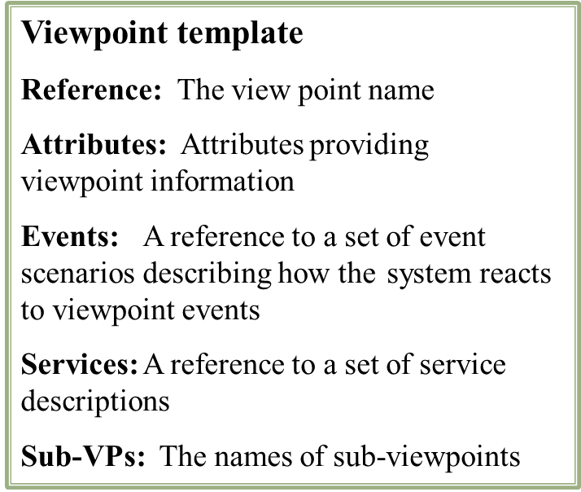
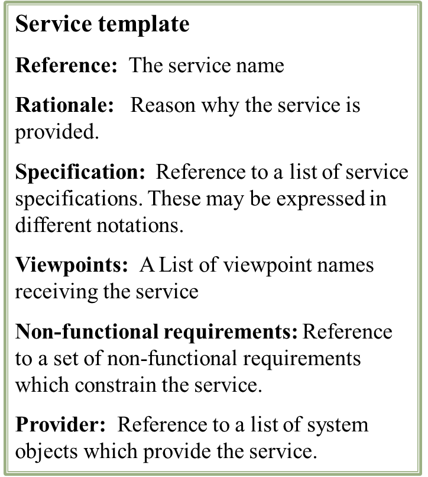
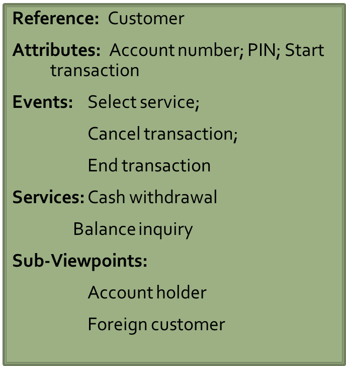
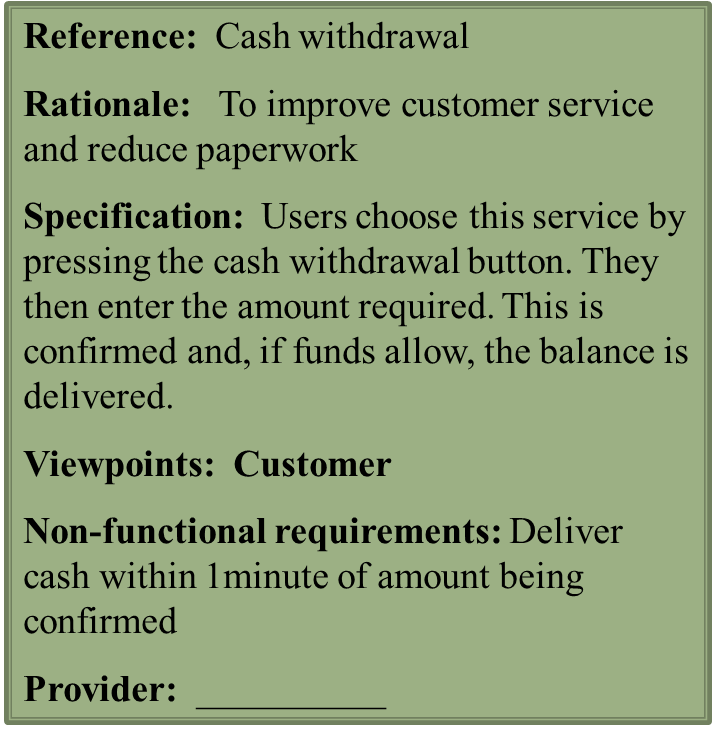

# Kravshåndtering

Egenskaper i en effektiv Requirements Engineering (RE) prosess
	1. Minimere forekomst av feil i krav
	2. Dempe virkningen av endring i krav
	3. Kritisk for suksess i ethvert utviklingsprosjekt

Målet med RE prosessen er å sikre at krav for et system kan tildeles en spesifikk programvarekomponent som da har ansvar for å tilfredsstille kravet. Når en slik tildeling er mulig:
* Den resulterende programvaren er ordentlig/riktig modulisert
* Modulene har tydelige grensesnitt
* Alle krav er tydelig separerte

## Kriterier for god kravshåndering
Håndtere view-points for systemet som skapes.
Håndtere ikkefunksjonelle krav og softgoals.
Håndtere identifikasjon og håndtering av krysskutting og ikke-krysskyttende krav
Håndtere innvirkningen av bruk av COTS, outsourcing og subcontracting.

##Viewpoints, perspektiv og views
* Viewpoint defineres som et standpunkt brukt av et individ når man undersøker et interesseområde- i vårt tilfelle, kombinasjonen av agent, og viewet som agenten innehar.
* Et perspektiv er definert som et sett fakta, observert og modellert i henhold til bestemte aspekter av virkeligheten.
* Et view defineres som en integrasjon av disse perspektivene.
* Et viewpoint språk er brukt til å representere viewpoints.

## Ulike typer viewpoints
_Datakilder eller -sluk :_ Viewpoints som produserer eller konsumerer data. Analyse involverer sjekking av at data produseres og konsumeres, samt. at antagelser om kilden og sluket er gyldige.
_Representasjons rammeverk:_ Viewpoints som representerer visse deler av en systemmodel(f.eks state-machine representasjon), passer særlig bra for sanntidssystemer.
_Mottakere av tjenester:_ Viewpoints som er eksterne til systemet og som mottar tjenester fra det. Passer best til interaktive systemer. 

## VORD-metoden

1. Identifikasjon av viewpoint - Identifisere viewpoints som mottar systemtjenester, og identifiser tjenestene som blir gitt til hvert viewpoint
2. Strukturering av viewpoint - Gruppere relaterte viewpoints inn i hierarki. Fellestjenester gis på høyt nivå i hierarkiet
3. Dokumentering av viewpoint - Utbedre beskrivelsen av de identifiserte viewpoints og tjenester.
4. Mapping av viewpoint - Gjøre om analysen til et objektorientert design. 

Et eksempel med Kunde(Customer) og skal ta ut penger (Cash withdrawal)

## Kravhåndtering - Viewpoint

### Fordeler med viewpoint-orientert tilnærming i kravhåndtering

* Assisterer med å forstå og kontrollere kompleksiteten ved å separere interessene til de ulike aktørene
* Eksplisitt gjenkjenne mangfoldet det er av kilder til krav
* Gir en mekanisme for å organisere og strukturere dette mangfoldet
* Får en slags fullstendighet
* Gir mulighet for kravkildene eller stakeholders til å identifisere og sjekke deres bidrag til kravene. 

### NFR
Et mål er oppnådd når alle dets delmål er oppnådd.
NFRF er sentrert rundt såkalte soft-goals, som ikke har noe klart kritere for oppnåelse. 
Slike myke-mål er oppnådd når det er nok positive og lite negative bevis for målet og vice-versa når det er mye negativt og lite positivt. 
Soft-goals analyseres i relasjon med hverandre. 

#### NFR(Non functional requirement) Framework(NFR Framework - NFRF):
Analyse for ikke-funksjonelle krav:

1. Starter med soft-goals som representerer ikke-funksjonelle mål. Disse er interessentene blitt enige om, f.eks usability, flexibility etc.
2. Hvert soft-goal refineres så ved å bruke dekomposisjon.

Dekomposisjon kan baseres på : Generell ekspertise rundt f.eks security, flexibility. Domene-spesifikk kunnskap. Prosjekt-spesifikk kunnskap.
Se foilene for eksempel på NFR analyse/dekomposisjon.

Fordeler ved NFR rammeverket:
NFR oppnås ved å samle kunnskap om domenet for et system skal bygges. NFRF fokuserer på å klargjøre meningen til de ikke-funksjonelle kravene. NFRF gir alternativer for oppfyllelse av soft-goals. 

### Cross-cutting(tverrgående) krav:
Et delmål, et konkret krav kan være involvert i oppfyllingen til flere enn et høynivå-mål. Mange ikke-funksjonelle krav faller i denne kategorien. 
F.eks : Ytelse er en faktor av systemarkitekturen. Vi kan ikke utvikle en ytelsesmodul som er uavhengig av de andre delene til systemet. Det er slike krav som kalles tverrgående krav.
Eksempler på slike er : Sikkerhet, mobilitet, tilgjengelighet og sanntids-begrensninger. 

#### Aspekt-orientert requirement engineering
Handler om å identifisere tverrgående krav tidlig i krav og arkitekturdesign fasen, istedetfor i implementasjonsfasen.
4 steg : Identifisere, fange(capture), komponere(compose) og analysere. 
Se foiler for dyptgående eksempel av et banksystem med tverrgående krav. Her prøver man å skrive om krav for å fjerne spredte konsepter. 

### COTS ( Commercial off the shelf)
Når størrelsen og kompleksiteten til systemer vokser, ser man på COTS som en mulig løsning. Her blir krav begrenset av tilgjengeligheten til passende COTS komponenter.
Viktig aspekt er å evaluere mulig COTS programvare tidlig i livssykelen til prosjektet. 

_Impact av COTS :_
For bedriftsapplikasjoner kan man bruke et stort COTS produkt til å levere et eller flere krav( f.eks MS Office, Oracle osv.)
For innebygde sanntids eller sikkerhetskritiske domener, er COTS forventet å være små, og kreve store mengder av "lim-kode" til å integrere COTS komponentene med resten av systemet.

_Problemer med COTS:_

* Begrenset tilgang til produktets interne design
* Beskrivelsen av kommersielle pakker er noen ganger ufullstendig og forvirrende
* Kunder har en begrenset sjanse til å verifisere hvorvidt et ønsket krav er møtt.
* De fleste av seleksjonsavgjørelsene er basert på subjektivitet, slik som partnerskap og markedsføring.

_Fordeler med COTS:_
vi får et produkt som har blitt testet mange ganger av ekte brukere med konsekvent forbedring av programvarekvaliteten. 
Se foil 8.2 (Requirements) for eksempel på COTS krav. 

### Krav for outsourcing
Outsourcing er en management strategi, hvor en organisasjon outsourcer store, ikke-kjerne funksjoner til tjenestetilbydere og 3rd parties. Stadig større.
Skiller mellom:

* Onshore : Outsource et prosjekt innad i eget land
* Offshore : Outsource til land utenfor europa(f.eks india)
* Nearshore : Nearshore vil for norge og skandinavia være baltiske land(ikke lange avstander)

#### Faser i outsourcing:

_Seleksjon_ : Velge underleverandør.
_Monitoring_ : Signere kontrakte og følge underleverandørens arbeid til produktet er levert.
_Fullføring_ : Akseptanse og installering av produktet, og også vedlikehold av produktet i dets levetid.

#### Fordeler og ulemper
_Fordeler:_ Kostnadsbesparende. Bedre tjenestelevering og kvalitet. Holde tritt med teknologisk innovasjon.
_Ulemper:_ Firmaer mister kontroll over business-processes og inhouse ekspertise. 

## Konklusjon
Flere måter å identifisere og behandle krav på, hver med sine iboende kompleksiteter og avhengigheter. 
Viewpoints prøver å eksplisitt modellere interessene til de ulike aktørene. 
NFR rammeverk fokuserer på å modellere soft-goals og klargjøre dems mening.
Tidlige aspekter fokuserer på å identifisere tverrgående forhold i krav i en tidlig fase av prosjektet.
Fins ytterligere kravbehandlingshensyn når man bruker COTS eller outsourcer. 