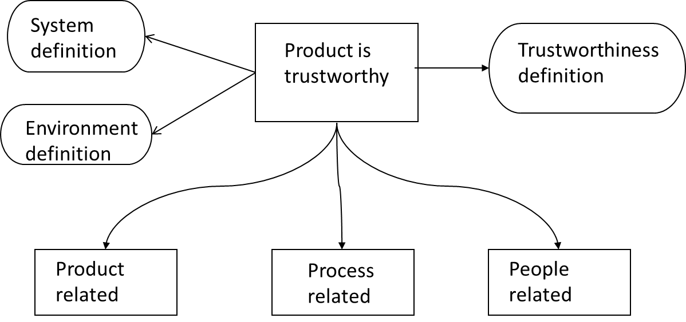

## Ansvar
Viktig å tenke på:

* Firmaet som bringer produktet til markedet har fult ansvar for produktets kvalitet
* Er bare mulig å søke om oppreisning etter en outsourcing, dersom vi kan bevise at de ikke fullførte sin kontrakt.

## Testing og selvtillit
Rollen testing har under:

* utvikling - Finne og fjerne defekter
* Akseptanse - Bygge selvtillit i komponenten

Når vi tester COTS eller komponenter hvor utviklingen har blitt outsourced/subcontracted, ønsker vi å bygge selvtillit(confidence).

### Skape tillit til produktet:
Man kan bygge tillit basert på : Produktet i seg selv, f.eks en COTS komponent. Prosessen - hvordan den ble utviklet og testet. Folket - personalet som har utviklet og testet komponenten. 

### Skape tillit til prosessen:
Tillit i prosessen stammer fra tre kilder:
Hvem gjør det? - "Teamet er kompetent" . Hvordan blir det gjort? - "Metoden adresserer problemet". Vi kan sjekke at prosessen blir brukt korrekt - "Prosessen er sporbar".

## Testing og outsourcing
Når vi outsourcer utvikling, må testingen være en integrert del av utviklingsprosessen. Testing blir da altså et kontraktsspørsmål. Fra trustworthiness mønsteret ser vi at vi må inkludere krav for:
Komponenten - Hva . Kompetansen til personalet - Hvem . Prosessen - Hvordan.

### Krav ved outsourcing. 
Når man skal tegne en outsourcing kontrakt bør man inkludere: 

* Krav til personell - riktige personer til jobben, se CV til hver person.
* Utviklingsprosessen - inkludert testing. Slik tillit kan komme fra sertifikater(f.eks ISO 9001) eller egne prosessrevisjoner. 
* Prosjektplan - når skal de gjøre hva?
* Test strategi - Hvordan vil de teste komponentkravene våre?
* Testplan - Hvordan vil testene bli kjørt?
* Testlogg - hva var resultatet av testene?

### Tillit i komponenten
Tilliten vi har til en komponent avhenger av hvor fornøyd vi er med svarene på spørsmålene over. Vi kan dog også bygge tillit på tidligere relasjoner med selskapet. Dess større denne tilliten basert på tidligere erfaringer er, jo mindre strenge behøver vi være i kontrakten. 

## Teste COTS
COTS testes ved å benytte black-box testing eller domene-partisjonstesting. Erfaringer tilsier at vi vil få mest utav innsatsen ved å fokusere på tester for : Intern robusthet, og ekstern robusthet.

### Robusthet

* Intern Robusthet : Evnen til å behandle feil i komponenten eller dens miljø. Her trenger vi wrappers, feilinjeksjon etc. Her er komponenter som kun er synlige innenfor systemets grenser. 
* Ekstern robusthet : Evnen til å behandle feil input. Her trenger vi kun komponenten "som den er". Her er komponenter som er del av brukergrensesnittet. 

Viktigheten av disse to typene vil variere , avhengig av typen komponentener vi tester. 

#### Intern robusthet
Intern robusthet er evnen til å :

* Overleve alle feilaktige situasjoner som; Minnefeil - både kode og data. Feiling av funksjonskall, inkludert kall til OS funksjoner.
* Gå til en definert , _trygg_ tilstand etter å ha gitt feilmeldingen. 
* Fortsette etter en slik feilaktig situasjonen med et minimumstap av informasjon.